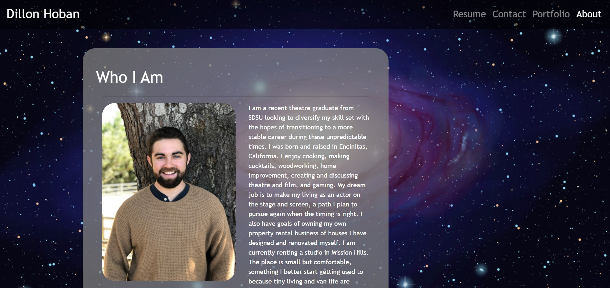

# Hello I am Dillon and this is my Portfolio

## Description

I am a student in the UCSD Coding Bootcamp expecting to graduate in March of 2021. This is my first portfolio site! As you can see there are many more elements to add and this will be a work in progress throughout the course. This site was built utilizing HTML, CSS, and Bootstrap. 

The site has three pages: 
1. About contains a brief bio and headshot.
2. Portfolio is where I will place images of my finished projects (updates to come!)
3. Contact is a basic form that will be updated in future idiarations (see Future Updates below.)

All pages are styled using the same stylesheet and each have unique Bootstrap elements. 

## Deploymet

Click the link [here](https://dillonhoban.github.io/Responsive_Portfolio/) to check out my site in your browser.

## Future Updates

I plan to go back and fix a few elements on my site. I want to add a JavaScript (I think it's JS although I am not 100% certain) element to my navbar to make it transparent at the top of the page but opaque when the user scrolls down. I also want to fix the small layout items in my CSS for example the alignment of my transparent grey containers is not perfectly centered. I will also be updating the contact page form to email me the submission when the user presses “Send,” again more JS work to be added soon!

## Validation 
This site’s HTML was validated using a third party service found [here.](https://validator.w3.org/)

## Acknowledgments

A special thank you to [Christina](https://github.com/Christina2021), [Ravi](https://github.com/ravifindravicom), [Brian](https://github.com/btparker70), and [Emily](https://github.com/ethomas22). Without you fine folks the study group would not be as awesome!

  
  
  

